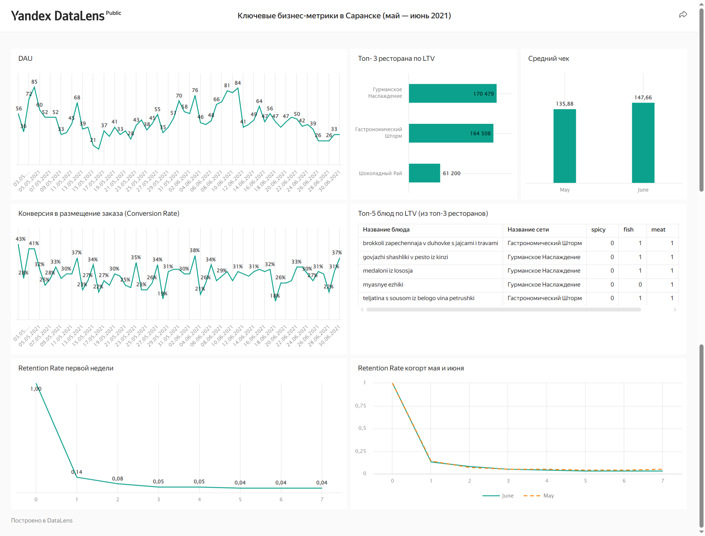

# 📊 DataLens Dashboard — визуализация и анализ ключевых метрик сервиса доставки еды

В рамках работы были подготовлены QL-запросы, визуализированы ключевые метрики (DAU, конверсия, средний чек, LTV, Retention Rate), собран дашборд в DataLens и составлен аналитический отчёт. Проект помогает бизнесу оперативно оценивать состояние клиентской базы и принимать управленческие решения.

## Бизнес-контекст задачи

Сервис доставки еды «Всё.из.кафе» расширяет клиентскую базу в Саранске и ищет инструмент для регулярного мониторинга показателей. Бизнесу важно понимать, как меняется активность пользователей, сколько клиентов возвращаются за повторными заказами и какова ценность клиента на длинной дистанции. Для этих целей был разработан дашборд с основными метриками.

## Цель проекта

Проанализировать ключевые метрики клиентской базы сервиса доставки еды «Всё.из.кафе» в Саранске за период с 1 мая по 30 июня 2021 года и на основе этого разработать дашборд с основными показателями, а также подготовить аналитическую записку с выводами для бизнеса.

## Этапы работы

1. Написание **QL-запросов** в DataLens для визуализации следующих метрик:
- DAU — количество активных пользователей за день.
- Conversion Rate — коэффициент конверсии.
- Средний чек — средняя сумма покупки на пользователя.
- LTV — совокупная ценность клиента за период.
- Retention Rate — коэффициент удержания пользователей.

2. Создание **визуализаций (QL-чартов)** и формирование **дашборда**.

3. Подготовка **аналитической записки** с анализом ключевых метрик.

## Результат

### [Ссылка на дашборд](https://datalens.yandex/e38sblt82vdaz)

## Основные выводы

- DAU снижается в праздничные и выходные дни, также наблюдается общий спад активности  во второй половине июня.

- Показатели Conversion Rate из регистрации в размещение заказа в целом стабильны, но демонстрируют спады по пятницам.

- Средний чек увеличился в июне по сравнению с маем, но одновременно произошло снижение DAU, что может указывать на сокращение притока новых пользователей из-за повышения цен.

- Retention Rate у июньской когорты ниже, чем у майской — как на следующий день, так и на 7-й день.

- Наибольший вклад в LTV ресторанов вносят премиальные блюда.

- Рестораны, специализирующиеся на кондитерских изделиях, показывают низкий LTV, что может свидетельствовать о меньшей популярности этого сегмента, более низком среднем чеке или редких повторных заказах.

## Рекомендации

- Выяснить причины снижения показателей вовлечённости (DAU, Conversion Rate, Retention Rate) в июне по сравнению с маем: проанализировать маркетинговые кампании, использованные для привлечения пользователей в эти месяцы, а также оценить возможное влияние сезонности, сравнив результаты с аналогичными периодами предыдущих лет.

- Поскольку активность пользователей снижается в выходные и праздничные дни — разработать специальные акции или предложения, приуроченные к этим дням, чтобы простимулировать спрос.

- Развивать партнерство с премиальными ресторанами с высокими чеками, т.к. они приносят наибольший LTV.
