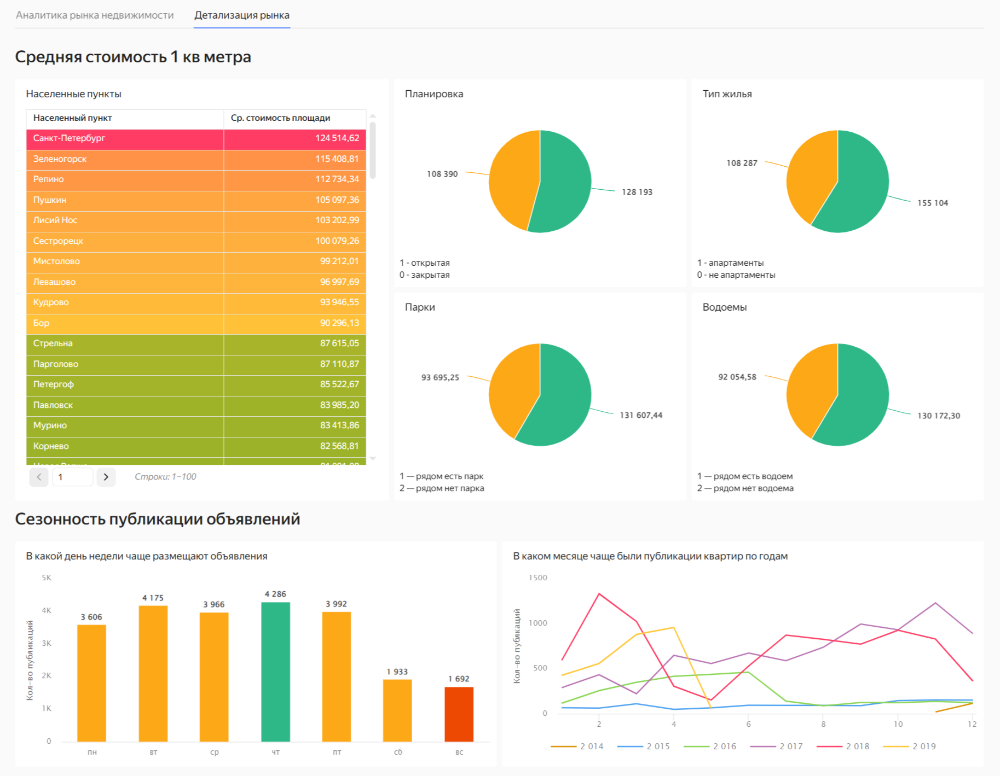

# 📊 Дашборд для агентства недвижимости

## Бизнес-контекст задачи

Агентство недвижимости из Петрозаводска планирует выйти на рынок Санкт-Петербурга и Ленинградской области, а также перевести основной офис в новый регион. Клиенты агентства часто запрашивают подбор объектов в разных населённых пунктах, и текущий процесс занимает много времени.

## Цель проекта

Создать дашборд, который позволит быстро анализировать рынок недвижимости в Санкт-Петербурге и Ленинградской области, а также оперативно подбирать подходящие объекты под клиентские запросы.

## Структура дашборда

### Страница 1 — Аналитика рынка недвижимости

- **Фильтры**: дата объявления, апартаменты, открытая планировка, населённый пункт, тип населённого пункта, гранулярность (day/week/month/year).

- **Индикаторы**: уникальное число квартир, среднее число комнат, средняя площадь, площадь кухни, жилая площадь.

- **Визуализации**:

  - Линейные графики динамики (кол-во квартир, средняя цена, среднее время продажи).

  - Топ-5 в виде линейчатых диаграмм (по кол-ву квартир, по цене, по сроку продажи).
  

### Страница 2 — Детализация рынка

- **Таблица**: все населённые пункты + средняя стоимость м².

- **Диаграммы**:

  - Круговые — структура по планировке, типу жилья, близости к паркам и водоёмам.

  - Столбчатая — количество объявлений по дням недели (сезонность).

  - Линейная — динамика публикаций по месяцам и годам.

### Результат

#### [Ссылка на дашборд](https://datalens.yandex/lnidq2ssa0ce7)
